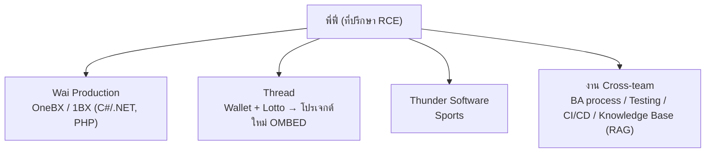
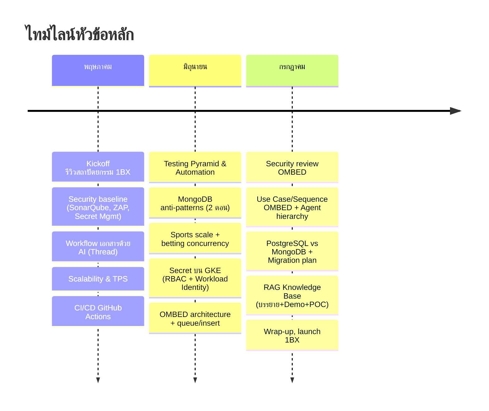
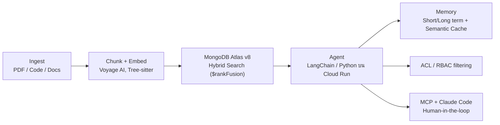

# สรุปภาพรวม: One Group — RCE Engagement (พ.ค. – ก.ค. 2026)

การ consult โดยที่ปรึกษา (พี่ฟี่) ผ่าน Google Meet รวม **23 มีตติ้ง** (พ.ค. 8, มิ.ย. 8, ก.ค. 7 ครั้ง)
ให้ 3 ทีมในเครือ One Group โดยแต่ละมีตติ้งสลับ/รวมทีมตามหัวข้อ
(ตั้งแต่ปลาย พ.ค. จัดตารางเป็น อังคาร = Wallet + Sports, พฤหัส = OneBX + Wallet)
โควตา ~35 ชม./เดือน สัญญารอบแรกสิ้นสุดปลายเดือน ก.ค.

> สรุปรายมีตติ้งอยู่ในโฟลเดอร์ [`summaries/`](summaries/) และ transcript เต็มอยู่ใน `transcripts/`

## เส้นเรื่องหลักของ engagement

1. **เดือน พ.ค. — Discovery + วางรากฐาน**: รีวิวสถาปัตยกรรม/CI/CD, ตั้ง Security baseline, สอนแนวคิด Scalability, วาง workflow เอกสารด้วย AI
2. **เดือน มิ.ย. — ลงลึกรายระบบ**: MongoDB เชิงลึก (anti-patterns, sharding), Testing Pyramid, แก้ปัญหา concurrency ของ Sports/Lotto, secret management บน GKE
3. **เดือน ก.ค. — โปรเจกต์ใหม่ + ปิดรอบ**: รีวิว OMBED เต็มรูปแบบ, แผน migration, และเปิดหัวข้อใหญ่ **Knowledge Base กลางแบบ RAG/Agentic AI** พร้อมเตรียม launch 1BX สิ้นเดือน

---

## 🟦 ทีม 1: Wai Production (OneBX / 1BX)

ระบบหลัก 1BX (C#/.NET 10, PHP/Laravel, Go) บน GCP — GKE Fleet, GitHub monorepo + ArgoCD + Config Sync, MongoDB Atlas

| ประเด็น | สิ่งที่ทำ/ตกลง | มีตติ้ง |
|---|---|---|
| Architecture discovery | Hub-spoke VPC, VPN ไป AWS, รีวิว CI/CD; พี่ฟี่ได้ access GitHub/ArgoCD | 05-07 |
| Security | จัดลำดับ: Secret Management (GCP Secret Manager) → vuln scan/pentest ใน pipeline; baseline ด้วย SonarQube + OWASP ZAP (ฟรี) + Cloud Armor/WAF | 05-07, 05-20 |
| MongoDB Atlas | Checklist ความปลอดภัย (OIDC, RBAC, private endpoint, BYOK, field encryption) + รีวิว performance (UUID vs ObjectID, unbounded array, ESR rule) + บรรยาย anti-patterns 2 ตอน | 05-07, 06-10, 06-17 |
| Scalability | คอนเซ็ปต์ TPS/RPS/QPS, connection pool, Redis cache, load test ด้วย K6/Locust | 05-27, 07-08 |
| Database เชิงกลยุทธ์ | เทียบ PostgreSQL/Citus vs MongoDB, Tiger Cloud vs Atlas สำหรับ analytics | 07-10 |
| แผน launch | **1BX launch สิ้นเดือน ก.ค. / เวอร์ชันแรกต้นเดือน ส.ค.** | 07-08 |

## 🟩 ทีม 2: Thread (Wallet, Lotto → OMBED)

จุดเน้นคือ**เอกสาร + โปรเจกต์ Wallet ใหม่ "OMBED"** (Go?, PostgreSQL, GitHub Actions, Docker)

| ประเด็น | สิ่งที่ทำ/ตกลง | มีตติ้ง |
|---|---|---|
| Workflow เอกสารด้วย AI | Markdown เป็น source กลาง + VS Code/Copilot สร้าง SRS/Sequence diagram, repo กลาง BA→Dev | 05-15, 05-12 |
| Use Case / PRD | Permission แบบ row-based, เชื่อม Use Case–Test Case–UI–Code, sign-off requirement ก่อนโค้ด | 05-12, 05-22 |
| OMBED | รีวิว architecture, security review (lock IP ที่ Gateway, private network, IAP/PSC), Use Case/Sequence diagram, ลำดับชั้น Agent (Company>Master>Senior>Super>Agent>Member), กลไกถือหุ้น/อัตราจ่ายหวย | 06-19, 07-01, 07-03 |
| Scale/Concurrency | Lotto shared ceiling + queue/insert-based, แก้ race condition wallet ด้วย atomic update + retry, TimescaleDB HyperTable | 06-19, 06-26 |
| DevOps | Secret บน GKE → **RBAC + Workload Identity**, Grafana stack ใหม่ (Beyla/Alloy/Pyroscope), alert เข้า Telegram | 06-12, 06-26 |
| Migration | แผนย้าย Wallet เก่า MySQL/AWS RDS → OMBED PostgreSQL | 07-10 |

## 🟨 ทีม 3: Thunder Software (Sports)

เข้าร่วมน้อยครั้งกว่า แต่มีประเด็นเฉพาะเรื่อง scale + ความถูกต้องของการเดิมพัน

| ประเด็น | สิ่งที่ทำ/ตกลง | มีตติ้ง |
|---|---|---|
| Capacity | วิเคราะห์ peak 6.1k users, scale ได้ ~3 เท่า, **Feed Server เป็นคอขวด** | 06-12, 06-26 |
| Betting concurrency | ปัญหา race condition ตอนวางเดิมพัน → low-level lock / queue + insert-based | 06-12, 06-19 |
| Infra | แผน load test + ย้ายขึ้น Kubernetes (อ้างอิงแนวทาง 1BX), MongoDB sharding/index, Online Archive, K6, OpenTelemetry+Jaeger, Terraform vs Pulumi | 06-24, 06-26 |

## 🟪 งาน Cross-team

- **กระบวนการ BA/QA**: flow เอกสาร BA→Design/Backend, ClickUp เป็น single source of truth, sign-off requirement (05-18) / Testing Pyramid + test automation ผ่าน CI (06-05)
- **CI/CD มาตรฐานกลาง**: GitHub Actions environments/secrets, approval staging→production, reusable workflow template, validate ENV ด้วย git hook (05-29)
- **Knowledge Base กลาง (RAG/Agentic AI)** — หัวข้อใหญ่ช่วงท้าย engagement:

  เริ่มจากแนวคิด (07-01) → บรรยายสถาปัตยกรรม (07-08) → Demo จริง (07-16) → รีวิวแพลนคุณบี ผ่าน ให้เริ่ม **POC จากส่วน Ingest** (07-22)

## การบริหาร engagement

- รายงานผ่าน Telegram + รายงานชั่วโมงรายสัปดาห์/เดือน (ใช้จริง ~35 ชม./เดือน)
- Status report รายเดือน (06-12) + ฟอร์ม feedback รายโปรเจกต์ (07-08)
- มีการหารือต่อสัญญาหลังครบ 3 เดือน (สิ้นสุดปลาย ก.ค.) — feedback โดยรวมเป็นบวก

## ดัชนีมีตติ้งทั้งหมด

| วันที่ | ทีม | เรื่อง |
|---|---|---|
| [05-07](summaries/2026-05-07.md) | Wai | Kickoff discovery: architecture, CI/CD, MongoDB security, ลำดับงาน security |
| [05-12](summaries/2026-05-12.md) | Thread | รีวิว PRD/Use Case Wallet, row-based permission |
| [05-15](summaries/2026-05-15.md) | Thread | Workflow เอกสารด้วย AI (Markdown + Copilot) |
| [05-18](summaries/2026-05-18.md) | Cross | กระบวนการ BA, ClickUp, sign-off requirement |
| [05-20](summaries/2026-05-20.md) | Wai | Security baseline: SonarQube, OWASP ZAP, WAF |
| [05-22](summaries/2026-05-22.md) | Thread | เอกสาร API (Postman/Swagger), เปิดตัว OMBED |
| [05-27](summaries/2026-05-27.md) | Wai+Thread | Scalability/TPS, MongoDB scaling, K6/Locust |
| [05-29](summaries/2026-05-29.md) | ทั้ง 3 ทีม | CI/CD GitHub Actions, IaC, ปรับตารางประชุม |
| [06-05](summaries/2026-06-05.md) | ทั้ง 3 ทีม | Testing Pyramid, test automation ใน CI |
| [06-10](summaries/2026-06-10.md) | Wai+Thread | MongoDB performance review, PRD OMBED, CI/CD |
| [06-12](summaries/2026-06-12.md) | ทั้ง 3 ทีม | Status report, Sports scale/concurrency, secret GKE |
| [06-17a](summaries/2026-06-17_a.md) | Thread+Wai | Use Case Lotto, MongoDB anti-patterns (1) |
| [06-17b](summaries/2026-06-17_b.md) | Cross | MongoDB anti-patterns (2): transaction, pooling |
| [06-19](summaries/2026-06-19.md) | Thread+Thunder | OMBED architecture, queue แก้ concurrency |
| [06-24](summaries/2026-06-24.md) | Thunder | MongoDB sharding/index, K6, observability, IaC |
| [06-26](summaries/2026-06-26.md) | Thunder+Thread | Sports capacity, Grafana stack, race condition |
| [07-01](summaries/2026-07-01.md) | Wai+Thread | RAG/Code Agent, security review OMBED, logic หวย |
| [07-03](summaries/2026-07-03.md) | Thread | Use Case/Sequence OMBED, Agent hierarchy, ถือหุ้น |
| [07-08a](summaries/2026-07-08_a.md) | Wai | บรรยายสถาปัตยกรรม RAG/Knowledge Management |
| [07-08b](summaries/2026-07-08_b.md) | Cross | Wrap-up: infra GCP, ชั่วโมง, แผน launch 1BX |
| [07-10](summaries/2026-07-10.md) | Wai+Thread | PostgreSQL vs MongoDB, migration Wallet→OMBED |
| [07-16](summaries/2026-07-16.md) | Cross | Demo Agentic RAG knowledge base + MCP |
| [07-22](summaries/2026-07-22.md) | Cross | ออกแบบ KB กลาง (RAG/Agentic), อนุมัติเริ่ม POC Ingest |
