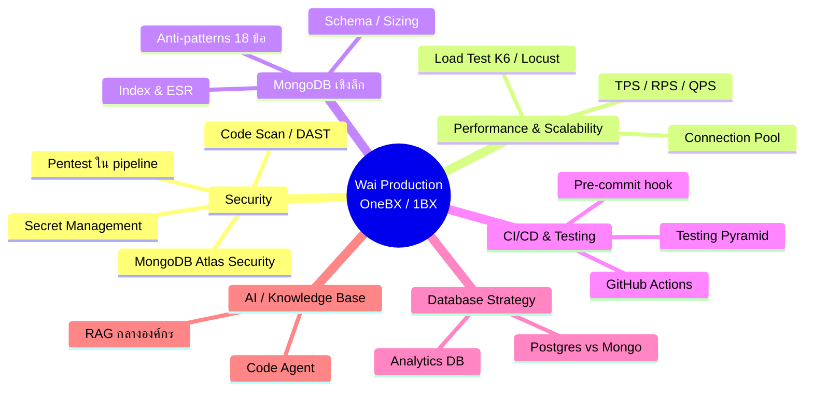
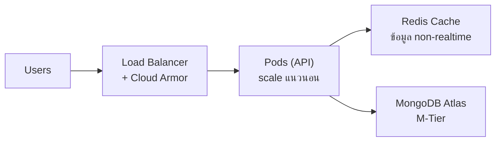
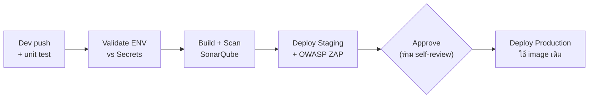

# Wai Production (OneBX / 1BX) — สรุปหัวข้อจากการบรรยายทั้งหมด

รวบรวมเนื้อหาจาก engagement "One Group – RCE" (พ.ค. – ก.ค. 2026) **เฉพาะส่วนที่เกี่ยวกับทีม Wai Production / OneBX (1BX)** จัดกลุ่มตามหัวข้อ ไม่เรียงตามวันประชุม
(อ้างอิงวันที่มีตติ้งไว้ท้ายแต่ละหัวข้อ — ดูรายละเอียดเต็มได้ใน `summaries/<วันที่>.md`)

**บริบทระบบ:** 1BX = แพลตฟอร์มเกม/เดิมพัน (C#/.NET 10 เป็นหลัก + PHP/Laravel ฝั่ง Autofast + Go) บน GCP — GKE (single cluster ต่อ business unit เชื่อมด้วย Fleet), Hub-spoke VPC, VPN site-to-site ไป AWS (ระบบ Wallet เดิม), GitHub monorepo + ArgoCD + Config Sync + Kustomize, MongoDB Atlas, Cloud Armor/WAF

---

## 1. Security (หัวข้อเปิด engagement)

### 1.1 Secret Management — ปัญหาเร่งด่วนอันดับ 1 *(05-07, 05-20)*
- **ปัญหาที่พบ:** ENV/connection string ของ production เก็บเป็น plaintext ใน Git (ArgoCD/GitHub) — Dependabot ไม่เตือน
- **แนวทางที่ตกลง:** ย้าย secret ทั้งหมดไป **GCP Secret Manager** (มี audit log, RBAC, กู้คืนได้, แยกจาก cluster)
- เสริมด้วย **pre-commit hook** กันไม่ให้ push security key ออกไป

### 1.2 กรอบ Security 3 ชั้น: Application / Infra / Database *(05-20)*
| ชั้น | เครื่องมือ/แนวทาง | สถานะ/ข้อตกลง |
|---|---|---|
| **Application** | **SonarQube** (Community, ฟรี) สแกน code ตอน build image ก่อน deploy + **OWASP ZAP** (DAST, ฟรี) ยิง staging URL ผ่าน Cloud Build → report score High/Med/Low | baseline เพียงพอ; ถ้าจะลงทุนให้ลงที่ SonarQube ก่อน (แก้ที่ต้นทางคุ้มสุด) |
| **Infra** | Cloud Armor (WAF) + Armor Policy ที่มีอยู่ | ไม่เปิดฟีเจอร์ OWASP บน WAF (กระทบ response time, แอปเก่า reject ทุก request) |
| **Database** | MongoDB Atlas: Private Endpoint + RBAC (1 service = 1 user/role) + Secret Manager | ถือว่าผ่าน baseline |
- **Burp Suite:** ยังไม่ซื้อ — เวอร์ชันเสียเงินมีไว้เพื่อ format report มาตรฐาน (จำเป็นเมื่อต้อง pitch/ให้ third-party ประเมินเท่านั้น)
- **Pentest** ต้องอยู่ใน scope (ผู้บริหารให้ความสำคัญ) — แบ่ง 2 phase: scan image/library ตอน build → scan แบบ user บน staging ดู score

### 1.3 MongoDB Atlas Security Checklist *(05-07)*
- Login ด้วย **OIDC** ผูก IAM กลาง (แทน database user/password)
- **RBAC/Custom Role ต่อ microservice** (1 service เห็นเฉพาะ database ตัวเอง)
- **Private Endpoint** (ดีกว่า VPC Peering) + IP lock ผ่าน VPN, TLS by default
- **Encryption at rest แบบ BYOK** (key เก็บใน Google Secret Manager)
- **Termination Protection** กันลบ cluster โดยไม่ตั้งใจ
- **Field-level encryption** สำหรับข้อมูลอ่อนไหว → ภายหลังเจาะเป็น **CSFLE / Queryable Encryption** (Master Key ที่ Google KMS, DEK บน MongoDB, ถอดรหัสฝั่ง app) *(06-10)*
- **Log export** ไประบบกลาง/Data Lake (เดิมไม่เคยดู log MongoDB เลย)

## 2. Performance & Scalability

### 2.1 แนวคิด TPS *(05-27)*
- **TPS = RPS (request หน้าเว็บ, ไม่แตะ DB) + QPS (query ที่ยิงเข้า DB จริง)** — 1 action อาจแตกเป็นหลาย query (แทง 1 ครั้ง ≈ 5 ขั้นตอน DB) เช่นผู้ใช้ 4,000 คน → ~9,000+ QPS
- Baseline slow query ของ MongoDB = **100 ms** (Performance Advisor จะแนะนำ index) — ควรใส่ App Name ใน connection string เพื่อรู้ว่า slow query มาจาก service ไหน
- **1 scenario = 1 transaction = 1 TPS** (login → ดูรายการ → รับ token → แทง)
- วิธีตอบผู้บริหาร "รองรับกี่คน": ตั้ง scenario จาก activity จริงแล้ว load test — ไม่ตอบตัวเลขลอย ๆ (บริบท: เว็บมีผู้เข้า ~12–13k/วัน peak แทงพร้อมกัน 2–3k)

### 2.2 การ Scale แต่ละชั้น *(05-27, 06-17)*

- Front-end/API: horizontal scale + **Redis cache** สำหรับข้อมูลที่ไม่ real-time/ไม่เกี่ยวกับเงิน; งานตัดเงินต้องยิงตรง DB
- **MongoDB:** 1 connection ≈ 1 MB RAM, `maxPoolSize` default 100 → 10 pods = 1,000 connections ≈ 1 GB RAM
  - จูน pool ราย service: API เรียกน้อย+query เร็ว → ลด pool; API เรียกถี่+operation นาน (update Wallet) → เพิ่ม pool
  - **Heuristic วินิจฉัย:** RAM พุ่งแต่ CPU ต่ำ = pool ใหญ่เกิน / เปิด connection ทิ้ง; pool ต่ำเกิน = ช้าเป็นช่วง ๆ จาก handshake/SSL
  - connection มี cap ตาม M-Tier — scale pod เยอะจะไปตันที่ tier

### 2.3 Load Testing *(05-27, 07-08)*
- **K6** — E2E integration test (ทีมใช้อยู่) ดู P90/P95/P99; **Locust** — ยิงตรง MongoDB (MongoDB แนะนำ) วัดว่า tier รองรับกี่ QPS สูงสุด ช่วยเลือก M-Tier
- **ปัญหาค้าง:** ยิงจากเครื่องเดียวได้แค่ ~350–1,000 VU (ติด CPU/core) ต้องการถึง ~10,000 → ต้องทำ distributed/cluster K6 (ยังค้างให้ที่ปรึกษาช่วยดูต่อ)

## 3. MongoDB เชิงลึก (เนื้อหาบรรยายชุดใหญ่)

### 3.1 Schema / Sizing review ของ 1BX *(06-10)*
- `_id`: เปลี่ยนจาก UUID (string ~36 ตัว) → **ObjectID** (12 byte, มี timestamp ในตัวใช้แทน Create Date ได้) — ประหยัด document + index size
- ชื่อ field มีผลต่อ size/RAM/bandwidth → อนาคตถ้า scale ใหญ่ พิจารณาชื่อย่อ + mapping layer ฝั่ง app
- ลบ **null/empty field** ที่ไม่จำเป็น (Mongo ไม่ต้องประกาศ field เหมือน .NET entity)
- **Unbounded array + index = performance ตก** → จำกัด ~500–1,000 แล้วแยก collection (pattern แบบ comment ของ Facebook)
- **Attribute Pattern**: field คล้ายกันหลายตัว (address 1–5) ทำเป็น key/value แล้ว index ตัวเดียว
- Naming convention ให้เป็น pattern เดียว (เจอ lowerCamelCase ปนจาก C# serialize)
- API Key sensitive → ใช้ CSFLE/Queryable Encryption

### 3.2 Anti-patterns ที่ dev ต้องเลี่ยง (บรรยาย 2 ตอน) *(06-17 a+b)*
**Query & Index**
1. ลดการใช้ `$lookup` ให้น้อยที่สุด
2. เก็บ date เป็น BSON date ไม่ใช่ string; ห้าม mix type ใน field เดียว (FK ต้อง type เดียวกับ PK)
3. document ห้ามเกิน 16MB — ห้ามเก็บ binary/ไฟล์ใน DB
4. ห้าม query ไม่มี index บน collection ใหญ่ (baseline ~1M docs)
5. **index < 20 ตัว** (write ช้าลงทุก index ที่เพิ่ม); ใช้ compound index แทน single-field หลายตัว; ลบ index redundant/unused
6. เลี่ยง `$ne`/`$nin`/`$where`/leading wildcard regex → ใช้ `$eq`/`$in`/text index/Atlas Search
7. เลี่ยง SELECT * — project เฉพาะ field; เลี่ยง `skip` pagination บนผลลัพธ์ใหญ่ → ใช้ cursor + `estimatedDocumentCount`
8. Aggregation เริ่มด้วย `$match` เสมอ ก่อน `$group`/`$sort`/`$lookup`
9. **กฎ ESR (Equality → Sort → Range)** — ออกแบบ index ให้ถูกตั้งแต่แรก, ไม่ sort ซ้ำเมื่อ index เรียงให้แล้ว (กัน sort in memory)
10. Index management: สร้างใหม่ก่อน → hide ตัวเก่าเป็น rollback plan (hybrid build ไม่ block ระบบ)

**Architecture & Operation**
11. **Shard key:** ห้าม low cardinality / monotonically increasing — เลือก field กระจายตัวดี (Transaction ID/ObjectID)
12. **Replica set 3 node = HA ไม่ใช่ scaling** — งาน real-time อ่าน Primary; report ที่ delay ได้อ่าน Secondary; analytics หนัก ๆ เปิด **Analytics Node** แยก
13. **Write Concern:** W0 (เร็ว, หายได้) / W1 / W majority (default, ปลอดภัย) — เลือกตามความสำคัญของข้อมูล
14. **Transaction:** เลี่ยงถ้า embed ได้; เคสจำเป็น (บันทึกเดิมพัน + call API operator ตัดเงิน) ให้ทำ atomic: begin → save → call API → commit/rollback — ดีกว่า insert แล้วกลับมา update status เอง
15. **Batch job ก้อนใหญ่ให้ซอย (chunking)** และเลี่ยงช่วง peak (18:00–ตี 1)
16. Reuse connection เสมอ — ห้ามเปิด connection ใหม่ทุก call
17. เซ็ต alert monitoring + ใช้ profiler/recommendation ของ Atlas

## 4. CI/CD & Testing

### 4.1 CI/CD *(05-29, 06-10)*
- ปัจจุบัน: GitHub monorepo + ArgoCD + Config Sync + Kustomize (1BX build ด้วย Cloud Build)
- แนวทางที่สอน: **GitHub Actions Environments** (staging/production) แยก Secret/Variable ต่อ env + **Required reviewers** (ห้าม self-review) → รวมเป็น **pipeline เดียว** (push staging → approve → deploy production อัตโนมัติ ใช้ image เดิม) + **reusable workflow template**
- **Validate ENV**: job แยกเทียบ config กับ GitHub Secrets ก่อน test — กัน deploy แล้ว ENV ไม่ครบ; ฝั่ง client ใช้ git hook/pre-commit
- ไม่วาง secret ใน repo — automation ผ่าน GitHub API; infra script ต้องขึ้น Git (versioning)

### 4.2 Testing *(05-07, 06-05)*
- **สถานะเดิม:** แทบไม่มี automated test — test ไม่ผ่านก็ commit ได้, พึ่งคนเทส (dev → BA/QA → go live)
- **Testing Pyramid:** Unit (map กับ step ใน Sequence diagram) → Integration/API → E2E — เริ่มจาก **Unit Test Automation ก่อน**
- กติกาใหม่: **dev ส่งโค้ดต้องมาพร้อม test** ถ้าไม่มี QA ตีกลับ; โค้ดเก่าทยอยเก็บ
- เครื่องมือ: Playwright/Selenium (UI/E2E), Postman CLI (API), GitHub Actions เก็บ report/history จับ regression; แนวคิดไฟล์ `test.md` ที่ root ระบุ test ทั้งหมดให้ script รัน
- **Integration test เป็นของ Senior/Lead** (คนเห็นภาพรวม) ไม่ใช่ dev รายฟังก์ชัน
- AI ช่วย generate test scenario/test case จาก Use Case/Sequence ได้ ให้คน review

### 4.3 เอกสาร Use Case / Sequence Diagram *(06-05, 05-29)*
- "หนู" (1BX) ทำ Use Case หน้า Member/Agent/Admin ครบ state แล้วต่อยอด Sequence diagram แบบ Markdown ใน VS Code
- หลักการ: **Sequence diagram ต้องครบทุก Use Case** (PID → Use Case → Sequence เหมือนซูมแผนที่) — ใช้ตรวจว่าโค้ดทำครบขั้นตอน และสื่อสารกับ non-technical ได้

## 5. Database Strategy *(07-10)*
- เทียบ **PostgreSQL/Citus vs MongoDB**: sharding/ACID ทำได้ทั้งคู่ — ตัดสินที่ความถนัดทีม + การออกแบบ schema; Atlas ได้เปรียบเรื่อง auto-scaling/rebalancing; Citus มีข้อกังวล licensing (Microsoft/Azure) และ support ในไทย
- **เกณฑ์ shard:** collection เดียวโตเกิน ~500GB (หลัง compression) ค่อยพิจารณา; ทำราย collection ไม่ใช่ทั้ง DB; RAM คือหัวใจ sizing (อย่าให้เหลือ < 10–20%)
- Zone/region sharding: ใส่ region ใน shard key ให้ MongoS route ตามประเทศได้
- **Analytics/Report DB:** คุณเบนเทียบ **Tiger Cloud (AWS) vs MongoDB Atlas** — ปัจจุบัน DB หลักอยู่ GCP, report คร่อมไป AWS; แนะนำคุย Commitment pricing

## 6. AI / Knowledge Base (หัวข้อช่วงท้าย engagement — ฝั่ง Wai เป็นเจ้าภาพ)

### 6.1 RAG Knowledge Base กลางองค์กร *(07-01, 07-08, 07-16, 07-22)*
- โจทย์จากคุณโดนัท/คุณบี (Wai): knowledge กระจุกในหัวคน, ต้องการที่เก็บกลาง + สิทธิ์เข้าถึง + พื้นที่ demo กลาง
- สถาปัตยกรรม 5 ขั้น: **Ingest → Chunk/Embed → Store → Retrieve → Generate** บน **GCP Cloud Run + MongoDB Atlas v8 (Hybrid Search/$rankFusion) + LangChain/Python (FastAPI) + Voyage AI embedding** — LLM ใช้ local/open model (Gemma/Qwen/Typhoon) เพราะแค่ปั้นคำตอบ ต้องรองรับภาษาไทย
- **Agent Memory:** Short-term (session + checkpoint, TTL) / Long-term (Procedural/Episodic/Semantic) / **Semantic Cache** (ตอบคำถามซ้ำโดยไม่เรียก LLM)
- **ACL/RBAC filtering** ตาม role/แผนก/โปรเจกต์ — ปลอดภัย + index แคบลง + ประหยัด token
- Update knowledge แบบ RAG (เทียบ md5 hash, re-embed เฉพาะที่เปลี่ยน) — **ไม่ fine-tune โมเดล** (แพง/กิน GPU)
- แนวคิดคุมต้นทุน: distributed pre-processing — ให้แต่ละคนตั้ง connector + coding agent ในเครื่อง embed เอง แล้ว push เข้า Atlas กลาง
- **สถานะล่าสุด (07-22):** แพลนของคุณบีผ่านรีวิว ไม่มี critical blocker → **เริ่ม POC จากส่วน Ingest** ประเมิน ~8 สัปดาห์

### 6.2 Code Agent *(07-01)*
- โจทย์คุณโด: dev หาย/ลา ต้องไล่โค้ดทั้งโปรเจกต์ — อยากได้ "หลีดของ codebase"
- แนวทาง: **ไม่ index ทั้ง codebase** — ทุก push/merge trigger summary ต่อไฟล์/ฟังก์ชัน เก็บ vector ใน MongoDB ให้ local model search (Level 1 ชี้จุด, Level 2 แก้ให้ ใช้ frontier model เฉพาะจำเป็น)
- Framework: **LangChain** (official MongoDB) vs Mastra — รอเทียบ JS vs Python; ต้อง design ร่วม Team Lead + อาจ refactor โค้ดให้ AI อ่านง่าย

## 7. สถานะ / Milestone ของทีม

| รายการ | สถานะ (ณ 22 ก.ค.) |
|---|---|
| Secret Management (GCP Secret Manager) | ตกลงแนวทางแล้ว — งานลำดับ 1 |
| SonarQube + OWASP ZAP | ที่ปรึกษาวางตัวตั้งต้น ทีมรับไป deploy ต่อ |
| MongoDB schema/index ปรับตามรีวิว | ทยอยแก้ (naming, null field, index) |
| Load test 10k users (distributed K6) | **ยังค้าง** — รอที่ปรึกษาช่วยต่อ |
| Security บางหัวข้อ | **ยังค้าง** |
| Knowledge Base POC (Ingest) | เพิ่งอนุมัติเริ่ม (07-22) |
| **Launch 1BX** | **สิ้นเดือน ก.ค. / เวอร์ชันแรกต้นเดือน ส.ค.** |

> มีตติ้งที่เป็นแหล่งข้อมูลหลักของทีมนี้: 05-07, 05-20, 05-27, 05-29, 06-05, 06-10, 06-12, 06-17 (a+b), 07-01, 07-08 (a+b), 07-10, 07-16, 07-22
